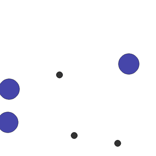

# Teaching Agents to Work Together

A short assignment in cooperative multi-agent reinforcement learning (MARL).

Three agents share one goal: cover three landmarks, one agent per landmark, without bumping into each other. No agent is told which landmark to take. The team has to learn to split the work.



*The starting point: agents (large blue circles) taking random actions. The landmarks are the small black dots.*

The game is `simple_spread` from the [MPE2](https://mpe2.farama.org/mpe2/simple_spread/) collection, which uses the [PettingZoo](https://pettingzoo.farama.org/) multi-agent API. Training uses PPO from [Stable-Baselines3](https://stable-baselines3.readthedocs.io/).

**No prior reinforcement learning experience is needed.** Everything runs on a laptop CPU.

- Time: about 6 to 8 hours of work, spread over one week.
- Deadline and submission: see the email you received with this link.

## 1. Setup

You need Python 3.10, 3.11 or 3.12 (not 3.13 or newer; see the tips at the end) and Git.

```bash
git clone <this repository's URL>
cd marl-teamwork-assignment
python -m venv .venv
source .venv/bin/activate        # Windows: .venv\Scripts\activate
pip install -r requirements.txt
python check_setup.py
```

The last command ends with `Setup OK.` if everything works.

**Google Colab** also works. Run `!git clone <URL>`, `%cd marl-teamwork-assignment` and `!pip install -r requirements.txt`. Colab has no screen, so use `--gif` instead of `--render` to see the agents.

## 2. What is in this repository

| File | What it does | Do you edit it? |
|---|---|---|
| `explore.py` | Task 1: look at the game, run a random policy | Yes, TODO 1a and 1b |
| `train.py` | Task 2: train one PPO policy for all agents | Yes, TODO 2a, 2b and 2c |
| `evaluate.py` | Compare a trained policy with the random policy; watch it or save a GIF | No |
| `plot_results.py` | Plot learning curves (mean over seeds, with a band of ± one standard deviation) | No |
| `check_setup.py` | Check your installation | No |
| `marl/` | Helper code: environment settings, evaluation metrics, training log | No, but read it. You may change it for Task 3. |
| `report/REPORT_TEMPLATE.md` | Template for your report | Copy it to `report/REPORT.md` |
| `results/` | Your runs, plots and GIFs are saved here | Generated |

Each TODO is marked `TODO(Task ...)` in the code. Until you complete it, the code stops with a `NotImplementedError` that names the TODO.

## 3. The assignment

### Task 1: Explore the game

1. Read the [simple_spread documentation](https://mpe2.farama.org/mpe2/simple_spread/).
2. Complete **TODO 1a** (random actions) and **TODO 1b** (split an observation into its parts) in `explore.py`.
3. Run it:
   ```bash
   python explore.py --render       # or: python explore.py --gif results/random.gif
   ```
   It prints what one agent sees, plays one random step and measures the random policy over 100 episodes.

In your report, answer in your own words:

- What does one agent observe? Name each part of the observation and its size.
- What actions can an agent take?
- How is the reward computed? Write it as a formula that uses `local_ratio`.
- Why do all agents often receive exactly the same reward?
- Give the random policy's results (the table printed by `explore.py`).

### Task 2: Train the team

1. Complete **TODO 2a, 2b and 2c** in `train.py`.
2. Train with three different random seeds:
   ```bash
   python train.py --seeds 0 1 2
   ```
   Each seed trains for 1,000,000 timesteps, which takes a few minutes on a laptop. For a quick test first, add `--timesteps 50000`.
3. Plot the learning curve and compare it with the random policy:
   ```bash
   python plot_results.py --group "shared PPO" "results/ppo_N3_lr0.5_seed*" \
       --random results/random_N3_lr0.5.json --out results/learning_curve.png
   ```
4. Watch the trained team and measure it:
   ```bash
   python evaluate.py results/ppo_N3_lr0.5_seed0 --gif results/trained.gif
   ```

In your report:

- Include the learning curve and the results table (trained policy and random policy).
- Answer the question in TODO 2a: why do all agents share one policy?
- All agents use the same policy. How can they still go to different landmarks?
- Describe what the trained agents do. Where do they still fail?

### Task 3: One small experiment

Choose **one** change:

- **A. Team size.** Train with `--n-agents 2` or `--n-agents 4`. Run `python explore.py --n-agents 4` for the new random baseline.
- **B. Reward mix.** Train with `--local-ratio 0.0` and with `--local-ratio 1.0`.
- **C. Hide the other agents.** Each agent can no longer see where the other agents are. This needs a code change. Make sure evaluation uses the same change as training. (mpe2's `num_agent_neighbors` argument cannot be 0, so you need another way.)

**Before you run it**, write your prediction in `report/REPORT.md` and commit it. Then run the experiment with three seeds, plot it (`plot_results.py --metric` also plots `final_distance`, `collisions` or `landmarks_covered`) and explain the result. A wrong prediction with a good explanation is a good answer.

### Task 4: Reflect

Half a page: What did the agents learn to do? Where do they still fail? What would you try next, and why?

### Bonus (optional)

- **Agent failure.** During evaluation, make one agent stop moving halfway through each episode. Does the rest of the team cover for it?
- **Separate policies.** Train one policy per agent instead of one shared policy, and compare. This is harder: Stable-Baselines3 has no built-in way to do it, so you would write your own training loop or use another library (for example [BenchMARL](https://github.com/facebookresearch/BenchMARL)).

## 4. What to submit

1. Your repository with the completed code and your `results/` folder (plots, JSON files, GIFs).
2. `report/REPORT.md`: 1 to 2 pages, with your answers, plots and tables. Start from `report/REPORT_TEMPLATE.md`.
3. A 5-minute presentation in your interview, followed by questions about your code and results.

Commit as you go. Your commit history is part of your submission.

## 5. Rules

- You may use any library, tutorial, forum or AI coding tool. Say in your report which ones you used and for what.
- You must be able to explain every line you submit. In the interview we will point at lines of your code and ask what they do.
- A result that did not work, clearly explained, is a good submission.

## 6. What we look for

- You understand the game, its observations and its reward.
- Your code runs, and your results can be reproduced with the commands in your report.
- You make a prediction, test it and explain the difference.
- You communicate clearly and honestly, including what failed.

We do **not** grade the final score of your agents.

## 7. Tips and common problems

- **`pip install` fails.**
  - On Python 3.13 or newer, the `tinyscaler` package (used by SuperSuit) has to be compiled and usually fails. Use Python 3.10, 3.11 or 3.12.
  - On a Mac with Apple silicon, use an Apple-silicon (arm64) Python, for example the Python 3.12 installer from python.org. An Intel build (for example an old Anaconda) cannot install a recent PyTorch. Check with `python -c "import platform; print(platform.machine())"`, which should print `arm64`.
  - On an Intel Mac, recent PyTorch is not available. Use Google Colab.
- **Timesteps** count agent steps: one step of the game with 3 agents is 3 timesteps. Training stops at the end of a full PPO update, so a run may go slightly past `--timesteps`.
- **`PPO(..., seed=...)` fails** with the SuperSuit wrapper (`'ConcatVecEnv' object has no attribute 'seed'`). Do not pass `seed`; `train.py` seeds everything for you.
- **The `--render` window does not open** (for example over SSH or on Colab): use `--gif results/name.gif` instead.
- **Training is slow**: close other programs, or test with `--timesteps 50000` first. One seed takes about 1 to 5 minutes, depending on your laptop, so Task 2 and Task 3 together need about 10 to 30 minutes of computer time.
- **Results differ between seeds**: that is normal in reinforcement learning. This is why you run three seeds and show the spread.
